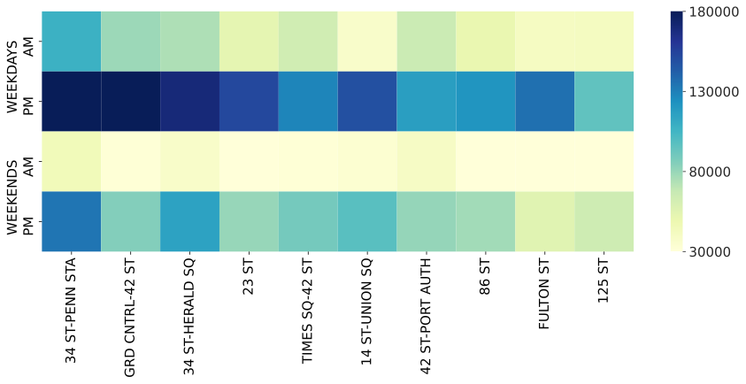
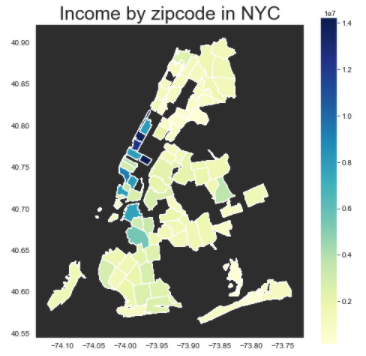

# Metis Data Science Bootcamp | Project 1
---

## Exploratory Data Analysis (EDA): NY Metro Transit Authority Turnstile Data

---
Project timeline: 4 days; final presentation of results [here](https://github.com/edubu2/metis-project1/blob/main/etc/presentation_project1.pdf)

### OUR TEAM
- Elliot Wilens
- Wei Zhao
- Liam Isaacs

---
### OUR REQUEST

WomenTechWomenYes (WTWY, a fictional organization) holds an annual gala at the beginning of each summer in New York City. To promote the Gala, WTWY will place street teams at entrances to subway stations. The street teams collect email addresses and those who sign up are sent free tickets to their gala (*View the full backstory [here](https://github.com/edubu2/metis-project1/blob/main/etc/project_background.md)*). WYWT wants to know: where does it make sense to position street teams?

---
### OUR QUESTION

How can we use MTA subway data to rationalize where it makes the most sense to place street teams to collect signatures and donations?

To use MTA subway data to help WTWY optimize the placement of their street teams such that they can gather the most signatures, ideally from those who will attend the gala and contribute to their cause.

---
### TECH STACK

The following Python libraries were used:
- jupyter notebook [*what is jupyter?*](https://www.dataquest.io/blog/jupyter-notebook-tutorial/)
- pandas
- numpy
- pandas
- matplotlib
- seaborn
- google geocode API
- geopy
- geopandas
- json
- requests

---
### REQUIRED RESOURCES TO REPRODUCE LOCALLY

- Python 3.x
- Git installation on your local machine and a GitHub account ([fork](https://docs.github.com/en/free-pro-team@latest/github/getting-started-with-github/fork-a-repo) this repository and then [clone](https://docs.github.com/en/free-pro-team@latest/github/creating-cloning-and-archiving-repositories/cloning-a-repository) to your machine)
- Install above Python libraries (if you're running anaconda, you probably havee most of them already)
- Google ['Geocode' API](https://developers.google.com/maps/documentation/geocoding/start) key - generate your own!

---
### NAVIGATING THIS REPOSITORY

Gathering, cleaning & merging data: [/code/clean2.py](https://github.com/edubu2/metis-project1/blob/main/code/clean2.py)
  - Curious about how it works? See [wtwy_data_merge.ipynb](https://github.com/edubu2/metis-project1/blob/main/code/wtwy_data_merge.ipynb)
  - Runtime: 1-5 minutes due to data volume, google API usage
  - Curious about how to use it? See [``fresh_start.ipynb``](https://github.com/edubu2/metis-project1/blob/main/code/fresh_start.ipynb)
  - Note: to use, clone this repository and open using JupyerLab/Jupyter notebook.
Analyzing data: [/code/analyze.py](https://github.com/edubu2/metis-project1/blob/main/code/analyze.py)
Visualizing data: for our cool graphs, keep scrolling! You can also see them here: [/figures](https://github.com/edubu2/metis-project1/blob/main/figures)

---
### Our Analysis

We present two models based off separate assumptions.

#### Model 1: Go to where the people are - go to these stations Tuesday-Friday, primarily during the AM hours 00:00-12:00.
*Assumption of the model*: the probability that any person will give you their signature is uniform across all people (it does not matter who they are); therefore, the stations with the most people (a characteristic we define as "Traffic") will maximize signatures.

We give a qualitative rationale as to which part of NYC hold the most foot traffic:

**Left: a qualitative repreesentation of Manhattan where each dot represents a station, whose color and size approaches blue & gets bigger as foot traffic increases. Right: a histogram of daily traffic is right-skewed, illustrating that the top 5-10 stations are much more trafficked than the majority.**

Using this assumption, we aggregate a list of top 10 stations by foot traffic, and further divide this into AM/PM periods:

A list of the top 10 stations for Model 1:
List (all on weekdays): (1) Penn Station (PM), (2) Grand Central (PM), (3) 34 Herald St. (PM), (4) Time's Square (PM), (5) Union St (PM).

#### Model 2: Go to the highest income stations.
*Assumption of the model*: people with more disposable income will donate more, so we prioritize placing street teams in higher income neighborhoods.

We give a qualitative picture of NYC by income:

**The darker the blue, the higher the adjusted gross income of that area.**

We advise that, if based off income, the Upper East Side area of Manhattan is considered.

---
### Our Final Recommendations

We recommend WomenTechWomenYes to distribute street teams according to a mixture of Model 1 and Model 2.

---
### Data Sources

All data files themselves can be found in [/code/data](https://github.com/edubu2/metis-project1/blob/main/code/data)

You can find their sources here:

- [MTA turnstile data](http://web.mta.info/developers/turnstile.html)
- [MTA Station zipcode data](http://web.mta.info/developers/data/nyct/subway/Stations.csv) 
- [NYC income by zipcode data](https://www.irs.gov/pub/irs-soi/18zpallagi.csv)
- [NYC zipcode by map (geodata)](https://jsspina.carto.com/tables/nyc_zip_code_tabulation_areas_polygons/public/map)
